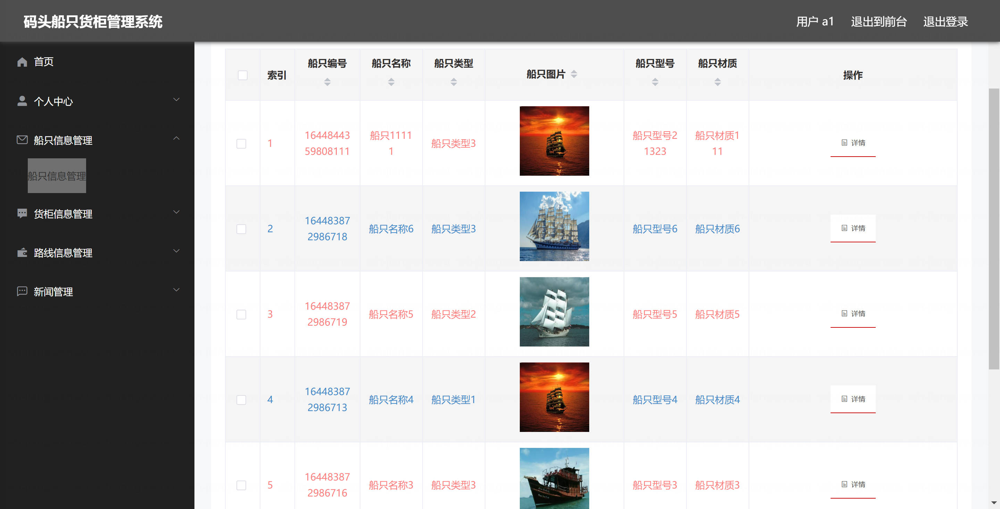

<h1 align="center">基于SpringBoot框架的码头船只货柜管理系统【带论文】</h1>

- <b>完整代码获取地址：从戎源码网 ([https://armycodes.com/](https://armycodes.com/))</b>
- <b>技术探讨、资料分享，请加QQ群：692619798</b>
- <b>作者微信：19941326836  QQ：3645296857</b>
- <b>承接计算机毕业设计、Java毕业设计、Python毕业设计、深度学习、机器学习</b>
- <b>选题+开题报告+任务书+程序定制+安装调试+论文+答辩ppt 一条龙服务</b>
- <b>所有选题地址 ([https://github.com/Descartes007/allProject](https://github.com/Descartes007/allProject)) </b>

## 一、项目介绍

基于SpringBoot框架的码头船只货柜管理系统，系统角色为管理员、用户，主要功能如下
### 管理员：
- 基本操作：登录、修改密码、获取个人信息、修改个人信息、退出登录
- 船只管理：筛选船只、获取船只列表、查看船只详情、新增船只信息、修改船只信息、删除船只信息
- 货柜管理：筛选货柜、获取货柜列表、查看货柜详情、新增货柜信息、修改货柜信息、删除货柜信息
- 路线管理：筛选路线、获取路线列表、查看路线详情、新增路线信息、修改路线信息、删除路线信息
- 新闻公告管理：筛选新闻、获取新闻列表、查看新闻详情、新增新闻、修改新闻、删除新闻
### 用户管理（前台用户）：筛选用户、获取用户列表、查看用户详情、新增用户、修改用户、删除用户、重置密码
- 后台账号管理：后台账号登录、注册、获取账号列表、查看账号详情、新增账号、修改账号、删除账号、重置密码
- 用户：
- 基本操作：登录、注册、修改密码、获取个人信息、修改个人信息、退出登录
- 船只管理：前端获取船只列表、筛选船只、查看船只详情、提交新增船只信息（需登录）
- 货柜管理：前端获取货柜列表、筛选货柜、查看货柜详情、提交新增货柜信息（需登录）
- 路线管理：前端获取路线列表、筛选路线、查看路线详情、提交新增路线信息（需登录）
- 新闻公告：获取新闻列表、查看新闻详情

## 二、项目技术

- 编程语言：Java
- 项目架构：B/S架构
- 前端技术：Vue、ElementUI、Vuex、Axios
- 后端技术：SpringBoot、MyBatis-Plus、MySQL

## 三、运行环境

- JDK版本：1.8及以上都可以
- 操作系统：Windows7/10、MacOS
- 开发工具：IDEA、Ecplise、MyEclipse都可以

## 四、数据库配置文件

- npm版本：6.14.13及以上都可以
- Redis版本：3.2.100及以上都可以
- 文件名：application.yml
- 编码类型：utf8

## 论文截图

## 系统截图

